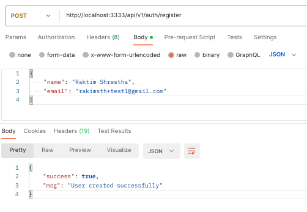
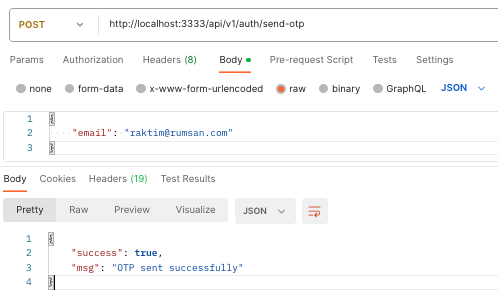
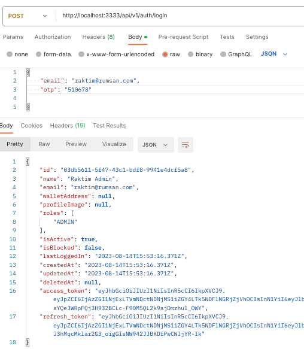
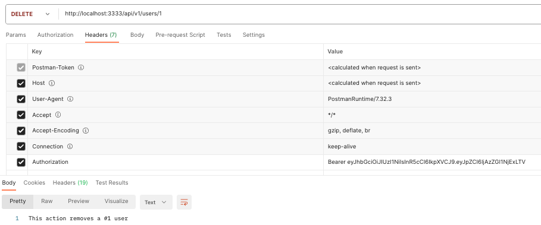
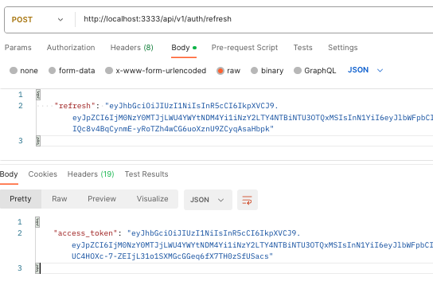

### Nest Js Seed with features

- [x] Project Setup using @nestjs/fastify(Fast and low overhead web framework, with a powerful plugin architecture, inspired by Hapi and Express)
- [x] Logging using @nestjs/commom logger
- [x] Swagger documentation using @nestjs/swagger with Authorization
- [x] Enabled dotenv support on Approot using @nestjs/config
- [x] API Versioning(/api/v1 , api/v2){default: /api/v1}
- [x] Enable RBAC
- [x] Added Docker Support
- [x] Create global custom exception filter to catch global errors
- [x] Use email and otp for user login instead of username and password; use otplib npm package
- [x] Enable User Authentication
- [x] Enabled Social Logins using Passport (JWT/ Local)
- [x] Added Mailing SMTP service for Mailing using Nodemailer with handlebars for email templates
- [x] Added Bull for Queuing purpose (currently using for Queuing Emails)
- [x] Replace Sqlite db with Prisma/Postgres
- [x] Linter (tslint + eslint + prettier)
- [x] Integration Testing / Unit Testing using Jest [With Test DB Environment]

## Description

[Nest](https://github.com/nestjs/nest) framework TypeScript starter repository.

## Requirements

- PostgreSQL
- Redis
- Nodejs 18 and above

## Installation

```bash
# Package Installation
$ npm install

# Copy the env example as .env file
$ cp .env.example .env

# Add your mailer service detail in .env file
```

## Application Setup

```bash
#setup the db migration
$ npx prisma migrate dev --create-only

#Push the db migration
$ npx prisma db push

#Run the seed to setup the DB
$ npx ts-node prisma/seed.ts
```

## Running the app

```bash
# development
$ npm run start

# watch mode (use this)
$ npm run start:dev

# production mode
$ yarn run start:prod
```

## Testing the API EndPoints

1. Visit the url shown in the terminal >>> http://localhost:3333/api/docs for more details

2. Register the User



3. Send otp to the User



4. Login



5. Use the Access token from Above to access protected route



6. Refresh the token


